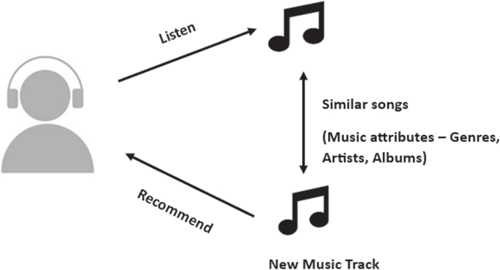
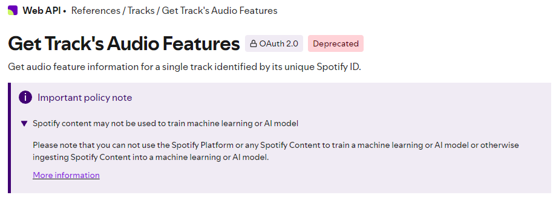

<a name="1"></a>
# End-to-End Spotify Recommender System (Sistema de Recomendação Spotify de Ponta a Ponta)


**[EN-US]**

* **Medium article** about this project in English: [Spotify Tracks Recommender System with Deep Learning](https://medium.com/@guineves.py/45d1bb3d3788);
* Complete code for this project, with all detailed explanations in English and Portuguese: [notebooks](./notebooks);
* Complete scripts for this project in English and Portuguese: [src](./src/).

**[PT-BR]**

* **Artigo no Medium** desse projeto em inglês: [Spotify Tracks Recommender System with Deep Learning](https://medium.com/@guineves.py/45d1bb3d3788);
* Códigos completos desse projeto, com todas as explicações detalhas em inglês e em português: [notebooks](./notebooks);
* Scripts completos desse projeto em inglês e em português: [src](./src/).

<a name="2"></a>
## About
**[EN-US]**

This repository contains the implementation of a Spotify music recommendation system with the Content-Based Filtering algorithm using Deep Learning.

The system was created end-to-end, that is, from the connection and authorization with the [Spotify API](https://developer.spotify.com/), extraction of data from the API, performing exploratory analysis and pre-processing of the data, definition of the model and inference, given the recommended songs, they are added to a Spotify playlist.

The Content-Based Filtering algorithm was created using the [tensorflow](https://www.tensorflow.org/?hl=pt-br) framework.

**[PT-BR]**

Esse repositório contêm a implementação de um sistema de recomendação de músicas do Spotify com o algoritmo Content-Based Filtering utilizando Deep Learning.

O sistema foi criado de ponta a ponta, ou seja, desde a conexão e autorização com a [API do Spotify](https://developer.spotify.com/), extração dos dados da API, realização da análise exploratória e do pré-processamento dos dados, definição do modelo e inferência, dada as músicas recomendadas, elas são adicionadas em uma playlist do Spotify.

O algoritmo do Content-Based Filtering foi criado utilizando o framework [tensorflow](https://www.tensorflow.org/?hl=pt-br).

<a name="3"></a>
## Table of Contents
* [End to End Spotify Recommender System](#1)
* [About](#2)
* [Table fo Contents](#3)
* [Setup](#4)
   * [Dependenceis](#4.1)
   * [Install](#4.2)
   * [Environment Variables](#4.3)
* [Run](#5)

<a name="4"></a>
## Setup
<a name="4.1"></a>
### Dependencies (Dependências)
* [python](https://www.python.org/)

<a name="4.2"></a>
### Install
```terminal
git clone https://github.com/guidasneves/spotify_recsys.git
python -m pip install -r requirements.txt
```

<a name="4.3"></a>
### Environment Variables (Variáveis de Ambiente)
**[EN-US]**

Definition of environment variables in the `.env` file, necessary for the system to run.
```text
CLIENT_ID_SPOTIFY:"the client ID generated after registering your application"
CLIENT_SECRET_SPOTIFY:"the client secret generated after registering your application"
```

**[PT-BR]**

Definição das variáveis de ambiente no arquivo `.env`, necessárias para a execução do sistema.
```text
CLIENT_ID_SPOTIFY:"o cliente ID gerado após registrar seu aplicativo"
CLIENT_SECRET_SPOTIFY:"o client secret gerado após o registro do seu aplicativo"
```

<a name="5"></a>
## Run
**[EN-US]**

All scripts are inside the [src](./src/), `./scr/` directory. Use Jupiter Notebooks in the [notebooks](./notebooks/), `./notebooks/`, directory with the complete system explanation of each step and the complete code for each step.

Notes:
* Spotify has removed the feature to extract the features of each track from the API.
* I would like to thank my mentor [Raphael Lima](https://www.linkedin.com/in/raphael-meira-lima/) for his guidance throughout the creation of this project.

**[PT-BR]**

Todos os scripts estão dentro do diretório [src](./src/), `./scr/`. Use os Jupiter Notebooks no diretório [notebooks](./notebooks/), `./notebooks/`, com a explicação completa do sistema de cada etapa e o código completo de cada etapa.

Notas:
* O Spotify removeu o feature para extrair as features de cada track da API.
  
* Agradeço ao meu mentor [Raphael Lima](https://www.linkedin.com/in/raphael-meira-lima/) pela orientação durante a criação deste projeto.
